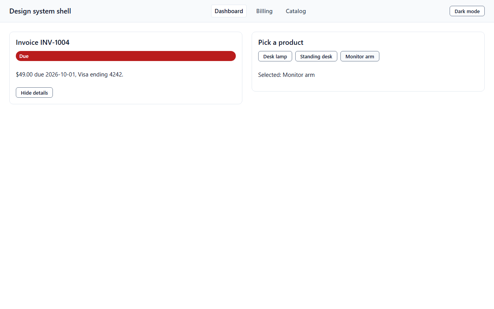
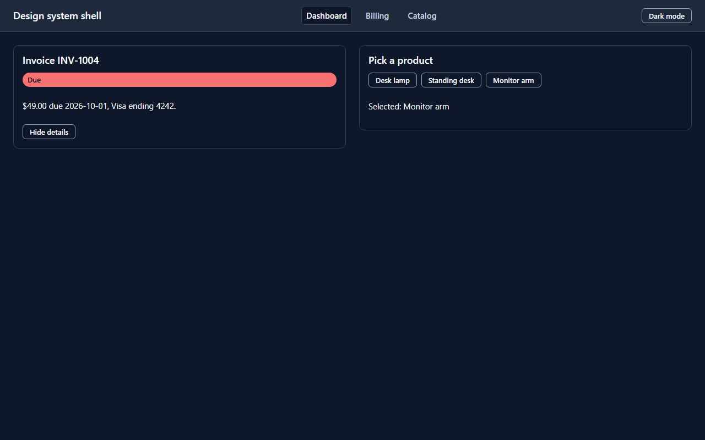
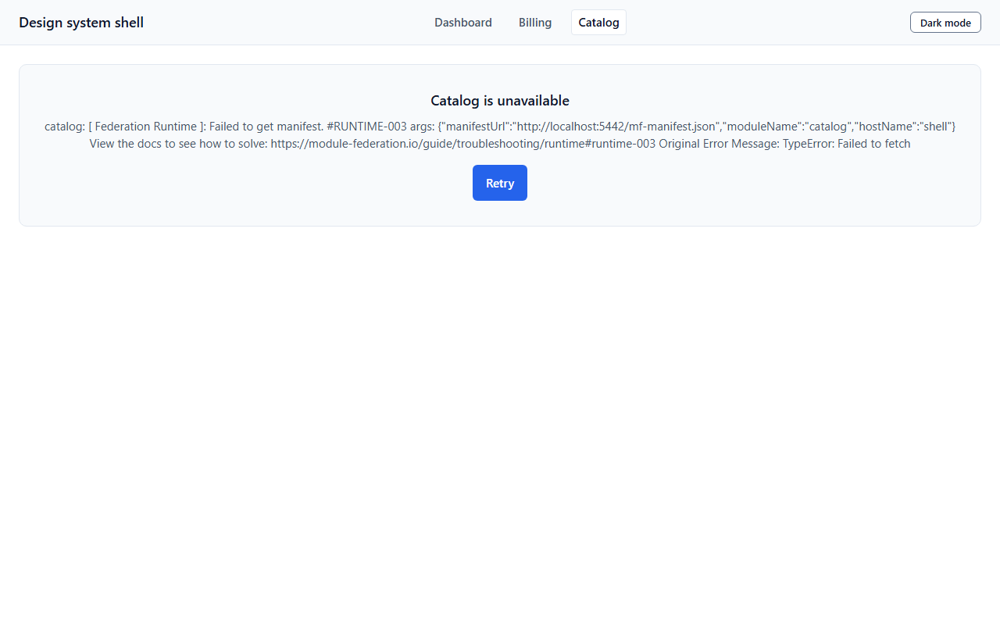
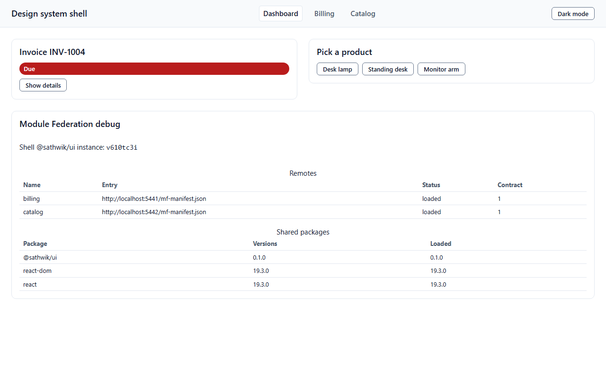
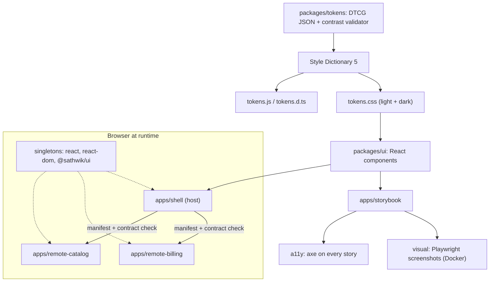

8 components, 100% of 22 stories under visual + a11y regression (88 screenshots, 0 serious/critical axe violations), two independently deployed remotes sharing one React and one design system

Source of every number below: [`bench/results/latest.json`](bench/results/latest.json), written by `pnpm report` from real test output.






## What this is

- **Tokens** (`@sathwik/tokens`): DTCG JSON compiled by Style Dictionary 5 into CSS variables (light and `[data-theme="dark"]`) and typed constants. The build fails if any text, border or accent pair drops below its WCAG contrast minimum in either theme (20 checks, 20 pass).
- **Components** (`@sathwik/ui`): React 19, CSS Modules on token variables only (a lint rule rejects raw colours and px), Radix for Dialog and Tabs.
- **Storybook 10** with a theme toolbar. Every story is checked by axe and by a screenshot in light and dark, at 375 and 1280 px.
- **Micro-frontends**: a shell loads a billing remote and a catalog remote at runtime (Module Federation on Rsbuild). React and `@sathwik/ui` are singletons. A dead, slow or incompatible remote shows a fallback and never takes the shell down.

## 5-minute quickstart

```bash
pnpm install
pnpm build
pnpm dev:mf      # shell on http://localhost:5440, billing 5441, catalog 5442
pnpm storybook   # http://localhost:5444
```

Or run the built demo in Docker (nginx serves the shell, both remotes and Storybook):

```bash
docker compose up -d --build
# http://localhost:5440 (shell), http://localhost:5444 (Storybook)
docker compose down
```

Open `http://localhost:5440/?mf-debug=1` to see the shared-package table.

## Install the packages

npm publish is not done yet (see [ADR 0010](docs/adr/0010-v0.1-scope-cuts.md)). Pack tarballs and install those:

```bash
pnpm build
cd packages/tokens && pnpm pack      # sathwik-tokens-0.1.0.tgz
cd ../ui && pnpm pack                # sathwik-ui-0.1.0.tgz
```

```tsx
import '@sathwik/tokens/tokens.css';
import '@sathwik/ui/styles.css';
import { ThemeProvider, Button } from '@sathwik/ui';
```

`pnpm pack:smoke` packs both, checks the tarball contents and imports the tokens package from the tarball.

## Architecture



## Invariants and the tests that prove them

| # | Invariant | Test |
|---|---|---|
| 1 | Contrast pairs pass in light and dark, or the token build throws | `packages/tokens/test/validate.test.ts` |
| 2 | References resolve, no cycles, known `$type` | `packages/tokens/test/resolve.test.ts` |
| 3 | No raw colour or px in component CSS | `packages/eslint-plugin/test/no-raw-design-values.test.ts`, `pnpm lint` |
| 4 | No serious or critical axe violation on any story, both themes | `tests/visual/a11y.spec.ts` |
| 5 | Every story x theme x viewport matches its baseline | `tests/visual/visual.spec.ts` (Docker) |
| 6 | One React and one `@sathwik/ui` at runtime, hooks work in remotes | `tests/e2e/singletons.spec.ts` |
| 7 | A remote with the wrong exposes, shared config or contract version is never mounted | `tests/contract/contract.test.ts`, `tests/e2e/incompatible-remote.spec.ts`, `packages/federation-contract/test/load.test.ts` |
| 8 | A dead or slow remote never breaks the shell or the other remote | `tests/e2e/remote-failure.spec.ts` |
| 9 | Dialog traps and restores focus, Tabs follow the arrow-key pattern | `packages/ui/src/Dialog/Dialog.test.tsx`, `packages/ui/src/Tabs/Tabs.test.tsx` |

Measured in this repo (from `bench/results/latest.json`): a dead remote showed its fallback after 322.5 ms; a slow remote with `timeoutMs` 1500 showed it after 1515.7 ms. `@sathwik/ui` gzips to 2175 bytes of JS and 1236 bytes of CSS; tokens CSS to 764 bytes.

## Commands

| Command | What it does |
|---|---|
| `pnpm build` | tokens, contract, ui, Storybook, shell, both remotes (and the contract-2 catalog build) |
| `pnpm lint` / `pnpm typecheck` | ESLint (incl. token-only CSS rule) / `tsc` in every package |
| `pnpm test` | Vitest in packages and the shell, plus `node --test` for the report script |
| `pnpm test:contract` | built manifests against the federation contract |
| `pnpm test:a11y` | axe over every story, light and dark (host Chromium) |
| `pnpm test:e2e` | composition, singletons, dead/slow/incompatible remotes (previews on 5440-5443) |
| `powershell -File scripts/visual.ps1` | screenshot comparison in the pinned Playwright image; `-Update` rewrites baselines (`scripts/visual.sh` for Git Bash) |
| `pnpm pack:smoke` | pack and inspect the two publishable packages |
| `pnpm report` | writes `bench/results/latest.json` and prints the headline |

## Decisions

[ADR 0001](docs/adr/0001-module-federation-rsbuild-runtime-registry.md) Module Federation on Rsbuild with a runtime registry ·
[0002](docs/adr/0002-pnpm-workspaces-without-turborepo.md) pnpm workspaces, no Turborepo ·
[0003](docs/adr/0003-one-playwright-suite-over-the-story-index.md) one Playwright suite over the story index ·
[0004](docs/adr/0004-visual-baselines-only-in-pinned-docker-image.md) visual baselines only in the pinned Docker image ·
[0005](docs/adr/0005-react-19-only.md) React 19 only ·
[0006](docs/adr/0006-token-validator-before-style-dictionary.md) validator before Style Dictionary ·
[0007](docs/adr/0007-css-modules-lint-and-toolchain-pins.md) CSS Modules, lint rule and toolchain pins ·
[0008](docs/adr/0008-strict-contract-version-and-safe-loading.md) strict contract version and safe loading ·
[0009](docs/adr/0009-ports-names-and-demo-stack.md) ports, names and the demo stack ·
[0010](docs/adr/0010-v0.1-scope-cuts.md) what v0.1 does not do.

## Limits

- Not published to npm yet; install from packed tarballs.
- Visual baselines are valid only in the pinned Docker image. Running them on the host is skipped on purpose.
- The Storybook Pages workflow and the CI workflows have not run on GitHub: the repo has no remote. They pass `actionlint` only.
- Eight components. Select, Checkbox, Switch, Toast, Table, a token gallery and Figma sync are not built.
- The remote fallback shows the Module Federation error text as the reason; it is not yet friendlier.
