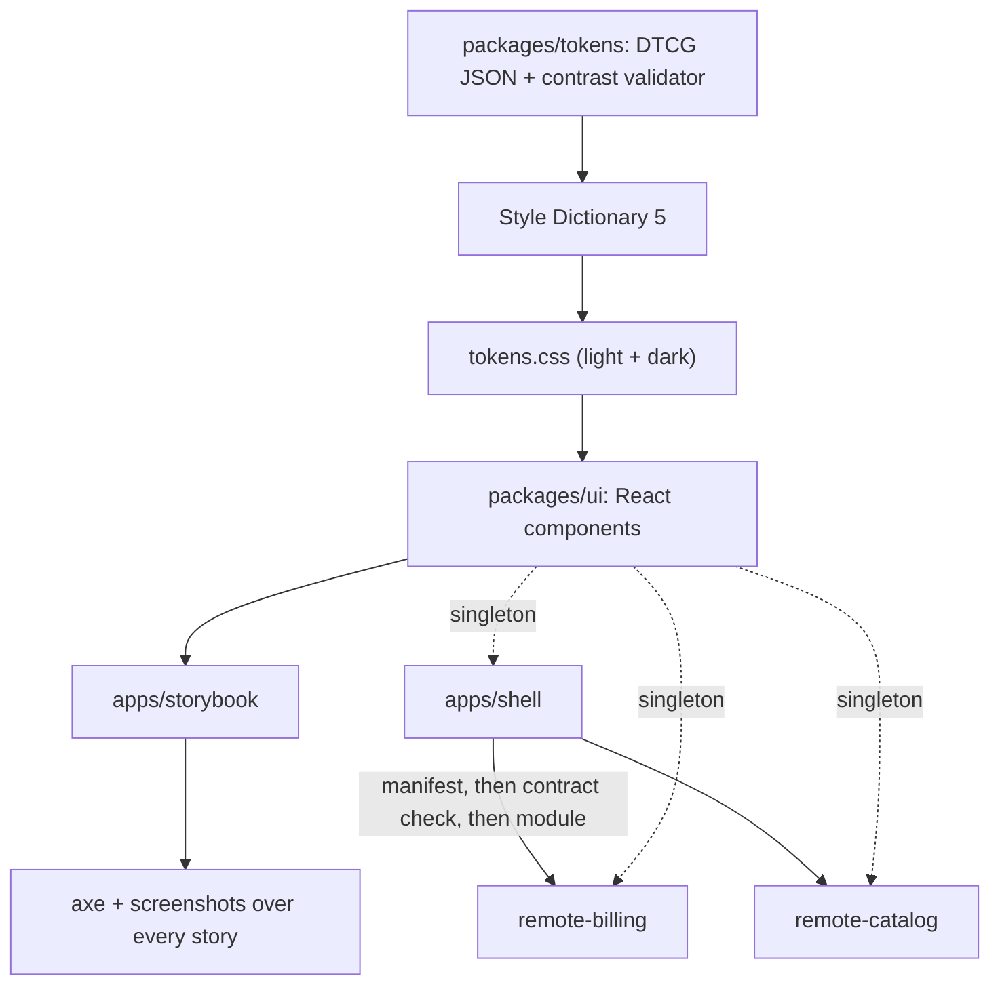

# Design system and micro-frontends: developer guide

## 1. What it is

A pnpm monorepo with four parts. Design tokens are compiled into CSS variables. A typed React library (`@sathwik/ui`) is built on those variables. Storybook documents it, and axe plus screenshot tests guard every story in light and dark. A shell app loads two separately built remotes (billing and catalog) at runtime and shares one React and one `@sathwik/ui` with them.

Measured headline (from `bench/results/latest.json`, written by `pnpm report`):

> 8 components, 100% of 22 stories under visual + a11y regression (88 screenshots, 0 serious/critical axe violations), two independently deployed remotes sharing one React and one design system

Other measured numbers: 20 of 20 contrast checks pass. A dead remote showed its fallback in 313.7 ms. A slow remote with a 1500 ms timeout showed its fallback at 1524 ms. `@sathwik/ui` is 2202 bytes of JS and 1237 bytes of CSS, gzipped. These come from the run at commit `e0fa0c7`.

## 2. Five-minute quickstart

```bash
pnpm install
pnpm build
pnpm dev:mf        # shell http://localhost:5440, billing :5441, catalog :5442
pnpm storybook     # http://localhost:5444
```

No dev setup? Run the built demo:

```bash
docker compose up -d --build
docker compose down
```

Add `?mf-debug=1` to the shell URL to see which shared packages are loaded.

## 3. Architecture



How a remote loads: the shell reads `public/remotes.json`, registers the remotes with the Module Federation runtime, and `RemoteRoute` calls `loadRemoteSafely`. That function loads `<remote>/contract` first and refuses the remote if its `CONTRACT_VERSION` differs from the host's. Then it loads the module. The whole sequence races a timer. Any failure becomes a typed error. The shell shows an `EmptyState` with short copy and a Retry button. The raw reason goes to `console.error` and the `data-reason` attribute. The registry also rejects a `remotes.json` entry whose `contract` differs from the host.

## 4. Project layout

| Path | What is in it |
|---|---|
| `packages/tokens` | DTCG sources, `contrast-pairs.json`, resolver, contrast validator, Style Dictionary build |
| `packages/eslint-plugin` | `no-raw-design-values` rule for CSS (private) |
| `packages/ui` | The component library, built with Vite library mode |
| `packages/federation-contract` | `CONTRACT_VERSION`, expected exposes, shared singleton list, `loadRemoteSafely` (private) |
| `apps/storybook` | Storybook 10 with a theme toolbar and stories for every state |
| `apps/shell` | Host app: router, registry, `RemoteRoute`, debug panel |
| `apps/remote-billing`, `apps/remote-catalog` | Remotes on Rsbuild 2; catalog also builds a contract-2 variant for e2e |
| `tests/contract` | Built manifests checked against the contract, with a negative fixture |
| `tests/e2e` | Composition, singleton, dead, slow and incompatible remote tests |
| `tests/visual` | axe and screenshot tests over `index.json`; baselines in `__screenshots__/` |
| `docker/`, `docker-compose.yml` | Visual-test image and the nginx demo stack |
| `scripts/` | `visual.ps1`/`visual.sh`, `pack-smoke.mjs`, `report.mjs` |
| `bench/results/latest.json` | The measured numbers |
| `docs/` | Spec, plan, ADRs, handoff |

## 5. Run, test and benchmark

| Command | What it does |
|---|---|
| `pnpm build` | Builds everything in dependency order |
| `pnpm lint`, `pnpm typecheck` | Lint (including the token-only CSS rule) and `tsc` |
| `pnpm test` | Vitest in packages and the shell, plus `node --test` for the report script |
| `pnpm test:contract` | Manifest checks (needs `pnpm build` first) |
| `pnpm test:a11y` | axe over every story in both themes (needs `pnpm build`) |
| `pnpm test:e2e` | Starts previews on 5440-5443 and drives the composed app |
| `powershell -NoProfile -File scripts/visual.ps1` | Compares screenshots in the pinned Playwright image |
| `powershell -NoProfile -File scripts/visual.ps1 -Update` | Rewrites the baselines (review the diff) |
| `pnpm pack:smoke` | Packs `@sathwik/tokens` and `@sathwik/ui`, imports tokens and type-checks ui as a strict `nodenext` consumer |
| `pnpm report` | Writes `bench/results/latest.json`; throws if an input is missing, from another commit, or has flaky tests |

Run `pnpm report` last, on the same commit as the a11y, e2e and visual runs. It reads all three and refuses stale or flaky results. A visual run that was skipped counts as 0%, never 100%.

README screenshots: `$env:DS_MEDIA='1'; pnpm --filter @ds/e2e-tests exec playwright test media.spec.ts`.

## 6. Key decisions and what they gave up

- [0001](adr/0001-module-federation-rsbuild-runtime-registry.md) Module Federation on Rsbuild with a runtime registry. Gave up: isolation (remotes share the host's JS realm), a single bundler (Vite for the library, Rsbuild for apps) and SSR.
- [0002](adr/0002-pnpm-workspaces-without-turborepo.md) Plain pnpm workspaces. Gave up: cached, affected-only builds.
- [0003](adr/0003-one-playwright-suite-over-the-story-index.md) One Playwright suite over the story index. Gave up: `play` functions as tests, and parity with the Storybook a11y panel (the two configs can drift).
- [0004](adr/0004-visual-baselines-only-in-pinned-docker-image.md) Baselines only in the pinned Docker image. Gave up: fast local visual loops and baseline updates on the host.
- [0005](adr/0005-react-19-only.md) React 19 only. Gave up: React 18 consumers and a React version matrix.
- [0006](adr/0006-token-validator-before-style-dictionary.md) Validate tokens before Style Dictionary. Gave up: a single resolver (references resolve twice; a test guards drift), nested TS token objects and alpha-aware contrast.
- [0007](adr/0007-css-modules-lint-and-toolchain-pins.md) CSS Modules, a lint rule and exact toolchain pins. Gave up: TypeScript 7 and ESLint 10, one-off pixel values, and props-driven styles.
- [0008](adr/0008-strict-contract-version-and-safe-loading.md) Strict contract version and safe loading. Gave up: minor-compatible contracts, cancelling a stalled fetch, and runtime prop checks.
- [0009](adr/0009-ports-names-and-demo-stack.md) Fixed ports 5440-5444 and an nginx demo. Gave up: default framework ports and a real CDN layout.
- [0010](adr/0010-v0.1-scope-cuts.md) What v0.1 leaves out.

Build notes worth knowing:

- `packages/ui` and `packages/federation-contract` use `.js` relative imports. That makes the published `.d.ts` files resolve under `nodenext`. `pnpm pack:smoke` checks it.
- A failed remote must not leak into another. The error boundary in `RemoteRoute` is keyed by `remote/module/attempt`; before that, a failed catalog fallback showed up on the billing page.
- The visual Playwright config picks its result file from the CLI arguments only. Its own path contains "visual", which once made the a11y run overwrite the visual results.

## 7. Known limits and what is left

- Not published to npm; no Changesets. Install from `pnpm pack` tarballs.
- No api-extractor report and no `size-limit` budget. Gzip sizes are recorded only.
- CI (`.github/workflows/ci.yml`) and the Storybook Pages workflow have not run on GitHub because the repo has no remote. They pass `actionlint`.
- One e2e run failed once during the build with an unidentified test and did not reproduce. Retries are now 0 locally and 1 in CI, and `pnpm report` fails on any flaky test.
- Eight components. Select, Checkbox, Switch, Toast, Table, a token gallery, Figma sync and SSR are not built.
- Visual baselines only run in Docker. On the host, `pnpm test:visual` skips.
- Sirv serves Storybook for the a11y and visual runs; there is no hosted demo.
